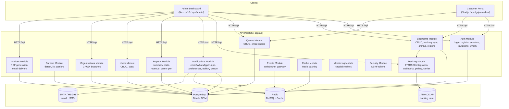

# Track — Architecture Overview

**Track** is a multi-tenant logistics management platform with three frontend apps and one NestJS API backend, orchestrated via Turborepo.

---

## System Overview



## Execution Flows

### 1. Login & Auth Flow (cross-community, 5+ steps)

```
[AuthContext.login()] → [api.post(/auth/login)] → [AuthController.login()]
  → [AuthService.login()] → [validatePassword()] → [TokenService.generateAccessToken()]
  → [TokenService.generateRefreshToken()] → [cookie + response body]
```

- JWT access tokens (short-lived) + refresh tokens (7-day) stored in httpOnly cookies
- Session records in `sessions` table for revocation
- Casbin RBAC: resources (shipments, quotes, users, organisations, auth) × actions (read, write, delete)
- Roles: `admin` (org-level), `staff` (branch-scoped), `customer` (own records only)

### 2. Shipment Tracking Sync (longest flow, 8 steps)

```
[Cron: pollStaleShipments()] → [syncStaleShipments()] → [syncShipment()]
  → [17TRACK API] → [updateShipmentFromTracking()] → [NotificationService.sendToAll()]
  → [checkRateLimit()] → [NotificationQueue (BullMQ)] → [NotificationProcessor.send()]
  → [EmailChannel | WhatsAppChannel | InAppChannel]
```

- **Polling**: `tracking-sync.service.ts` polls stale shipments every N minutes
- **Webhook**: `seventeen-track-webhook.controller.ts` receives push updates from 17TRACK
- Both converge on `updateShipmentFromTracking()` → `sendToAll()` for notifications
- Rate-limited per channel via `notification_logs` table

### 3. Shipment Creation Flow

```
[ShipmentsPage.handleCreateShipment()] → [api.post(/shipments)]
  → [ShipmentsController.create()] → [CarriersService.detectByTrackingNumber()]
  → [ShipmentsService.create()] → [TrackingService.registerShipment() (17TRACK)]
  → [NotificationService.sendToAll()] → [bull queue]
```

### 4. Invoice Email Flow

```
[ShipmentsPage "Send Invoice"] → [api.post(/invoices/:id/send-email)]
  → [InvoicesController.sendEmail()] → [check rate limit (lastInvoiceEmailSentAt)]
  → [InvoiceEmailQueue (BullMQ)] → [InvoiceEmailProcessor()]
  → [fetch org/branch data] → [generateInvoiceHtml()] → [puppeteer → PDF]
  → [EmailService.send() with download link]
```

- Rate limit: 2 emails per shipment per day (12-hour window)
- PDF attached as download link, not inline attachment

### 5. Reports Flow

```
[ReportsPage] → [api.get(/reports/summary?branchId=...&from=...&to=...)]
  → [ReportsController.getSummary()] → [resolve org/branch by role]
  → [ReportsService.getReportSummary()] → [stats, chart data, routes, carrier perf]
  → [ExportButton] → [buildReportHtml()] → [window.print() → PDF]
```

## Database Schema

| Table | Purpose |
|-------|---------|
| `organisations` | Multi-tenant orgs (slug, currency, country, logo) |
| `branches` | Org branches (address, contact, active status) |
| `users` | Auth users (role, org/branch FK, email verified) |
| `sessions` | Active auth sessions (IP, user-agent, expiry) |
| `shipments` | Core tracking records (tracking# , carrier, status, white-label code) |
| `shipment_events` | Tracking checkpoints from 17TRACK |
| `quotes` | Customer quotes (origin/destination, weight, price, status) |
| `carriers` | Carrier definitions (key, name, detection patterns) |
| `tracking` | 17TRACK registration mapping |
| `notifications` | In-app notification records |
| `notification_preferences` | Per-user email/WhatsApp/status toggles |
| `notification_logs` | Sent notification audit log |
| `invitations` | Pending user invites (token, role, expiry) |
| `verifications` | Email/password-reset verification tokens |

## API Module Map

| Module | Prefix | Key Endpoints |
|--------|--------|---------------|
| Auth | `/auth` | login, register, refresh, logout, sessions, invitations, verify-email, forgot/reset-password, google OAuth |
| Shipments | `/shipments` | CRUD, stats, activity, destinations, archive, restore, public tracking |
| Quotes | `/quotes` | CRUD, stats, activity, send-email |
| Users | `/users` | CRUD, stats, lookup, invite |
| Organisations | `/organisations` | CRUD, branches, hierarchy tree |
| Carriers | `/carriers` | List, detect by tracking number |
| Tracking | `/tracking` | Sync, register, stop, retrack, change carrier, webhook, quota, settings |
| Notifications | `/notifications` | List, read/unread, preferences, test endpoints |
| Reports | `/reports` | Summary with stats, charts, routes, carrier perf |
| Invoices | `/invoices` | Download PDF, send email |
| Search | `/search` | Cross-entity search (shipments, quotes, users) |
| Events | WebSocket | Org/user room-based real-time events |
| Monitoring | `/monitoring` | Circuit breaker status |

## Security

- **JWT** access tokens (Bearer) + **httpOnly refresh cookies**
- **Casbin RBAC** per endpoint: `{ resource, action }` matched against user role
- **CSRF** double-submit cookie pattern via `CsrfMiddleware`
- **Rate limiting** on login (10/min), forgot-password (5/day)
- **Multi-tenant isolation**: all queries scoped by `organisationId` from JWT

## Key Dependencies

| Dependency | Use |
|---|---|
| NestJS 10 | API framework |
| Next.js 16 | Admin dashboard (app router, Turbopack) |
| Drizzle ORM | Database layer with PostgreSQL |
| BullMQ | Background jobs (notifications, invoice emails) |
| Redis | Queue broker + cache |
| 17TRACK API | Shipment tracking data |
| Puppeteer Core | Invoice PDF generation |
| Nodemailer | Email delivery |
| MSG91 | SMS/WhatsApp provider |
| Casbin | Role-based access control |
| Recharts | Dashboard/report charts |
| shadcn/ui | Admin component library |

## Monorepo Structure

```
track/
├── apps/
│   ├── admin/          # Next.js 16 admin dashboard
│   ├── api/            # NestJS REST API
│   └── gajantraders/   # Customer-facing Next.js portal
├── packages/
│   ├── auth/           # Shared auth utilities
│   ├── config/         # Shared configuration
│   ├── ui/             # Shared UI components
│   └── utils/          # Shared utilities
├── turbo.json          # Turborepo task pipeline
└── pnpm-workspace.yaml
```
